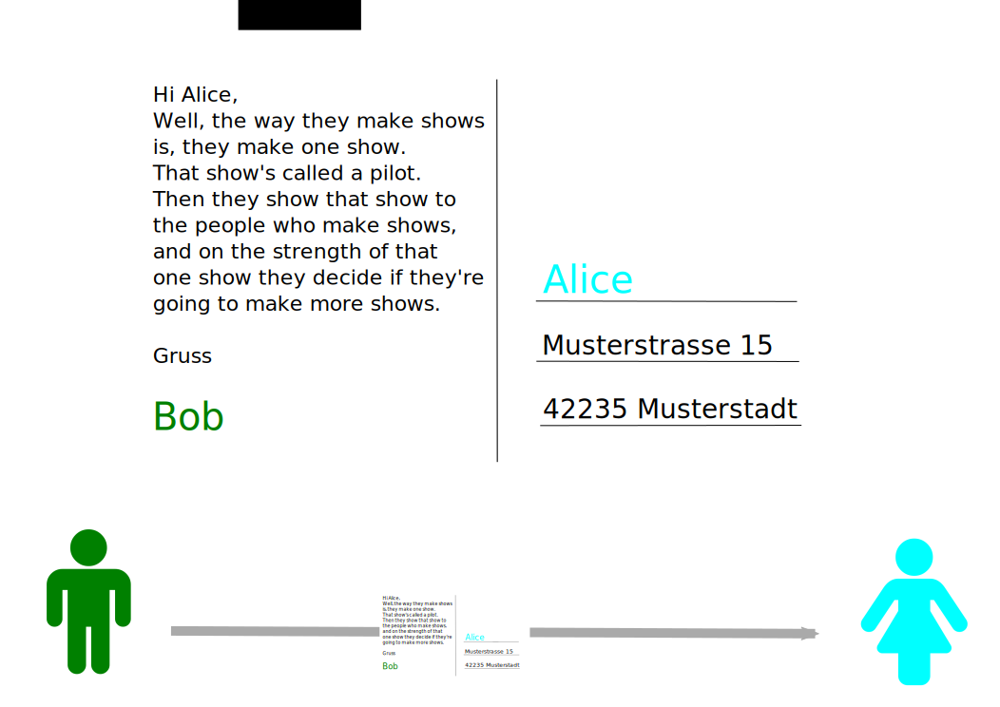

# Cryptoparty  Chaospott Essen

# Inhalt und Ablauf
 

* Wer wir sind
* Angebote
* Sichers surfen
* Passwörter
* Emailverschlüsselung
<!--- * Festplattenverschlüsselung  --->
<!--- * Chatverschlüsselung  --->
* Quellen

# Wer wir sind

# Angebote

# Sichers surfen

# Passwörter

# Emailverschlüsselung

## Warum verschlüsseln?

- Ich hab doch nichts zu verbergen

- Postgeheminis?

- Die Email ist doch nur für mich selbst und dem Empfänger

## Emails sind Postkarten

## Wie funktioniert Emailverschlüsselung?

